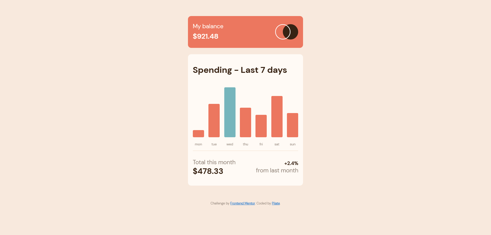

# Frontend Mentor - Expenses chart component solution

This is a solution to the [Expenses chart component challenge on Frontend Mentor](https://www.frontendmentor.io/challenges/expenses-chart-component-e7yJBUdjwt). Frontend Mentor challenges help you improve your coding skills by building realistic projects. 

## Table of contents

- [Overview](#overview)
  - [The challenge](#the-challenge)
  - [Screenshot](#screenshot)
  - [Links](#links)
- [My process](#my-process)
  - [Built with](#built-with)
  - [What I learned](#what-i-learned)
  - [Continued development](#continued-development)
- [Author](#author)

## Overview

### The challenge

Users should be able to:

- View the bar chart and hover over the individual bars to see the correct amounts for each day
- See the current day’s bar highlighted in a different colour to the other bars
- View the optimal layout for the content depending on their device’s screen size
- See hover states for all interactive elements on the page
- **Bonus**: Use the JSON data file provided to dynamically size the bars on the chart

### Screenshot

### Links

- Solution URL: [Here on Github](https://expense-tracker-fm-pilate.netlify.app/)
- Live Site URL: [here](https://expense-tracker-fm-pilate.netlify.app/)

## My process
 - I started by looking at the layout and tried to think about it in terms of semantics
 - Wrote html (trying to make it as semantic as possible)
 - Started styling with visual apearance in mind
 - Armtwisted the semantic html into looking how I liked/how the given layout should look
 - added JavaScript for dynamic stuff
  - I used the fetch api to get the local data
  - added dynamic data and relavent markup generated based on the data.
 - Finished!
### Built with

- CSS custom properties
- Flexbox
- Semantic HTML
- Mobile-first workflow

### What I learned

I have learnt that when writing html, concentrating with semantic is more important. CSS can turn any markup into any visual layout, so thinking visually should only start with CSS. 

### Continued development

I feel rusty on Grid, so I intentionally avoided it. It's an area I need to work on more

## Author

- Frontend Mentor - [@pilatech](https://www.frontendmentor.io/profile/pilatech)
- Twitter - [@pchinyengetere](https://www.twitter.com/pchinyengetere)
